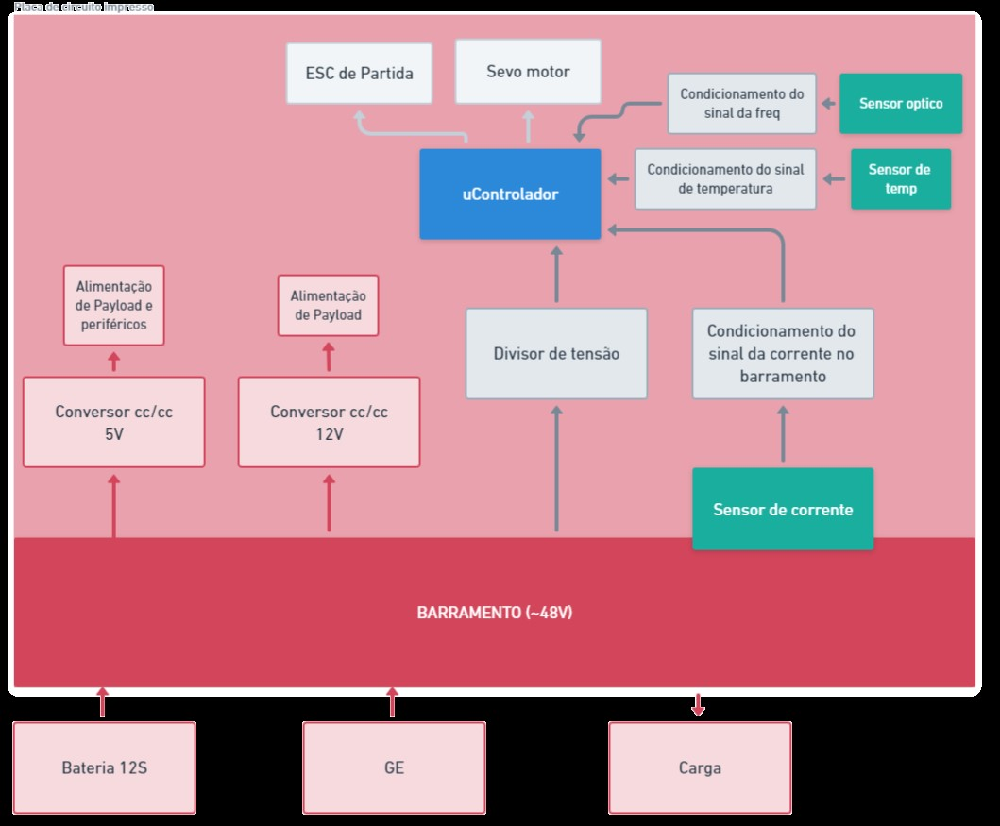
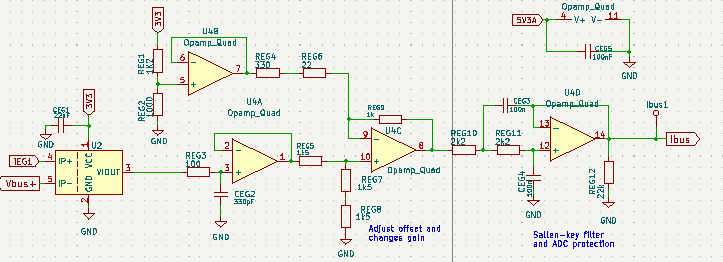
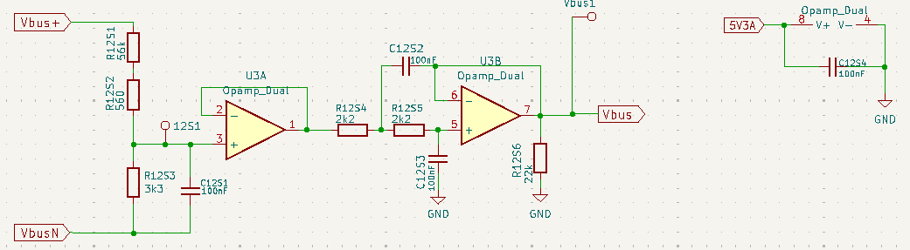

# 
 Comandos, Aquisição e Armazenamento de dados de uma bancada de teste de um sistema de energia híbrido para drone 

O mercado atual de drones, são raras as opções que possuem autonomia de voo maior que 50 minutos, fator esse que pode dificultar ou mesmo inviabilizar a realização de algumas missões. A marca mais conhecida do mercado (DJI) possui apenas uma opção comercial que promete atuar em uma margem maior de tempo que o limiar mencionado. Essa condição existe por conta das limitações de densidade energética dos armazenadores de energia disponíveis no mercado: baterias. Nesse contexto, uma opção viável para aumentar a autonomia consiste na utilização de conjuntos híbridos que podem ser embarcados na aeronave, utilizando um motor à combustão como parte do sistema de geração de energia elétrica.

Para implementar esse conjunto híbrido no drone, uma solução é importar sistemas pré-fabricados de geração de energia de outros países, como a China. Contudo a hipotética fabricação e nacionalização desse subsistema é uma solução interessante, haja vista o potencial de diminuição de custos, possibilidade de personalização da máquina e ausência dos trâmites de importação.

Para realizar esse projeto, foi desenvolvida uma bancada de testes pelo laboratório de drones do Instituto Federal de Ciência e Tecnologia de Santa Catarina (IFSC). O dispositivo consiste em um motor a combustão interna (MCI) acoplado a um motor BrushLess Direct Current (BLDC), que funciona como gerador de energia, e um retificador trifásico conectado à saída do gerador. Nessa configuração, o acelerador do motor à combustão possui um atuador eletromecânico (servo) que pode ser acionado eletronicamente por um sistema microcontrolado, que deve ajustar automaticamente e em tempo real a posição do acelerador conforme a energia demandada na saída o gerador trifásico (BLDC). Um dos principais desafios dessa simulação é desenvolver um sistema eletrônico de monitoramento e controle que mantenha a tensão constante mesmo com a variação da carga. Com o objetivo de desenvolver esse sistema de controle, é necessário projetar e confeccionar uma placa auxiliar que condiciona os sinais aferidos no sistema para um microcontrolador onde são tratados e armazenados em um log. Essa placa será desenvolvida no projeto integrador 3 e será detalhada a seguir.

Esse projeto integrador deve cumprir os seguintes requisitos, aferir e condicionar os sinais de RPM, temperatura do motor a combustão interna (MCI), corrente e tensão no barramento CC (pós-retificador) do sistema. Deve gerar dois sinais de pulse width modulation (PWM), um para o servo motor que acelera o MCI e outro para o driver que movimenta o BLDC para dar partida no motor. Esta placa também deve possuir dois conversores um de 12V e outro de 5V para a alimentação de payload e periféricos do drone. Assim como tem que gerar um arquivo de dados que contenha todos os sinais que foram monitorados. Na Figura 1, está delineado em formato de diagrama o projeto da PCI.

Figura 1 - Diagrama do hardware

<figcaption>Fonte: Acervo pessoal</figcaption>

#### Cronograma idealizado 

 12/03 - Cronograma 

 20/03 - Levantamento dos componentes de projeto e pré requisitos 

 27/03 - Levantamento dos componentes de projeto e pré requisitos 

 03/04 - Esquemático da placa 

 10/04 - Esquemático da placa 

 17/04 - Layout da placa 

 24/04 - Layout da placa 

 08/05 - Fabricação da placa, documentação e programação do micro 

 15/05 - Fabricação da placa, documentação e programação do micro 

 22/05 - 1° TESTE e levantamento de log para análise 

 29/05 - Ajustes 

 05/06 - 2° TESTE e levantamento de log para análise 

 12/06 - Ajustes 

 19/06 - Apresentação 

## Desenvolvimento

### Componentes

 Os componentes foram selecionados de acordo com a disponibilidade no laboratório e com os requisitos o projeto 

 Servo motor: MG995, a aplicação necessita de um servo robusto e esse componente tem disponível no laboratório 

 UControlador: F280025C da Texas Instruments, um microcontrolador que aguenta o sistema de controle que será aplicado futuramente 

 Sensor de corrente: ACS758 150B, o máximo de corrente que o sensor terá que medir é de 80A, o sensor escolhido mede até 150A e tem disponivel no laboratório 

 Conversor CC/CC 48V - 5V: THL15-4811WL, robusto suficiente para aguentar os picos de tensão (até 60V) e tem disponivel no laboratório 

 Conversor CC/CC 48V - 12V: EC5SBW-48S12, robusto suficiente para aguentar os picos de tensão (até 60V) e tem disponivel no laboratório 

 Sensor de temperatura: NTC 33950 100k, o sensor deve medir pelo menos de 10 C até 200 C, o sensor escolhido mede de -4 a 270 C 

 Amplificador Opercional: TLV 9044 DIR, escolhido pela disponibilidade no laboratório 

 Regulador de Tensão: LM 1117 

### Projeto

 O projeto foi realizado de acordo com diagrama de blocos demonstrado anteriormente

#### Leitura da corrente

O circuito utilizado para a leitura da corrento envolve o sensor (ACS 758B), o condicionamento de sinal e um filtro ativo passa-baixa (Sallen-Key). Para a adequar os niveis de tensão foi utilizado um circuito subtrator, descrito abaixo 

<picture>
 
</picture>

Para a tensão V1 maxima, levamos em consideração que quando a corrente é nula a tensão de saída do ACS vai ser Vcc/2 = 1.65.

Para a tensão V1 minima, levamos em consideração que quando a corrente é maxima a tensão de saída do ACS vai ser (Vcc/2) + (Corrente maxima * sensibilidade do sensor), a sensibilidade do sensor pelo datasheet é 13*10^-3 e a corrente  maxima prevista é 100 A (com uma certa sobra por precaução), com isso temos V2 = 2.95 

Para V2 é utilizado um divisor resistivo para conseguir a tensão de 1.5V (R1 = 1.2k ohm e R2=1k ohm).  

<picture>
 
</picture>

#### Leitura da tensão 

 Para a leitura da Tensão foi usado um divisor resistivo de tensão juntamente com um filtro Sallen-Key de segunda ordem (passa-baixa) para a diminuição de ruido na leitura do sinal. Para calcular o divisor resistivo foi assumindo que R1 = 56560 ohm (dividido em dois resistores um de 56k ohm e outro e 560 ohm), R2=3k3 ohm e com uma tensão maxima de 60V. Para o calculo do filtro Sallen-Key, foi previsto pelos professores do laboratori de dornes uma frequência de corte de 723 Hz para o filtro, para a definição dos capacitores e resistores foi utilizada a formula fc = 1/(2*pi*sqrt(R1*C1*R2*C2)) onde ao definir C1 e C2 com 100 nF, temos R1 e R2 de 2k2 ohm. O esquemático é mostrado na figura abaixo. 

<picture>
 
</picture>

### Esquemático 

Através do software KiCad e com os requisitos levantados anteriormente foi realizado a implementação do esquemático (pdf com o esquemático completo na pasta do projeto), que é composto por 5 Blocos principais: 

 - Alimentação: O bloco de alimentação é formado pela conexão da Bateria de 12S (aproximadamente 48V) e a conexão do Gerador Elétrico

 - Potência: Possui dois conversores THL15-4811WL (para 5V) e o EC5SBW-48S12 (para 12V), com o circuito sugerido na folha de dados

 - Conexões: São as conexões que a placa possui com o meio esterno, primeramente o 4 conectores XT60 que são usados para a conectar a carga (para testes inicias uma carga resistiva), 3 conectores JST-XH de duas vias, um para a alimentação da bomba que auxilia no resfriamento o motor, outro para aferir a temperatura e por último para a ignição do motor, 6 conectores JST-XH de 3 vias sendo, para o esc que vai acionar o BLDC para dar a partida no motor a combustão, para o servo motor que auxilia no controle, um que recebe um pulso da controladora de voo para o acionamento remoto do motor, e dois reservas caso venha a precisar no futuro, alem desses conectores temos nesse bloco um optacoplador para proteção do circuito com o sinal que vem do tacomêtro, um jumper para a alimentação do F280025C caso precise debugar o circuito no computador, um modulo para leitura do cartão SD e dois leds para informações. Para a comunicação com a controladora de voo foi prevista duas conexões, uma por JST-XH  e uma por JST-GH, para conseguir utilizar os dois tipos de controlaora disponiveis no laboratório (cube orange e pixhalk)

 - Condicionamento do Sinal: Contendo dois sinais que precisam ser ajustados para a leitura no F280025C a tensão que passa por um divisor resistivo para diminuir a tensão, um buffer e um filtro Sallen-Key e a corrente que após passar por um sensor de efeito hall (ACS758) passa por um buffer, um circuito somador para amplificar a tensão fornecida pelo sensor e um filtro sallen-key, o detalhemento desses dois circuitos está fornecido na folha de calculos.

### Layout

O layout seguiu os seguintes requisitos:

  
- Deixar todos os componentes na parte superior da placa assim como os pontos de medição de tensão

  
- A parte de potência separada e com menor interatividade com o resto da placa

  
- Conectores na borda da placa 

  
- Malha de potência no barramento (no bloco de alimentação) 

  
Os requisitos foram pensados para evitar ruídos indesejados, evitar que a placa sobreaqueça, melhor conexão dos perifericos e para que acaso haja algum problema no futuro seja fácil de encontrar o que está gerando.

### Programação
