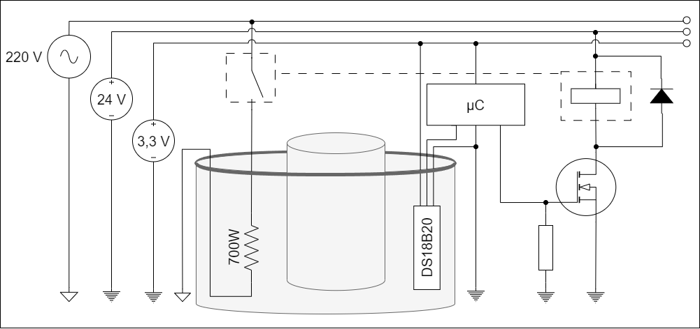

<table rules="none" width="90%" align="center">
<tr>
    <td></td>
    <td style="text-align: justify;vertical-align: top;"><b>
    

    INSTITUTO FEDERAL DE EDUCAÇÃO, CIÊNCIA E TECNOLOGIA DE SANTA CATARINA 
    CAMPUS FLORIANÓPOLIS 
    DEPARTAMENTO ACADEMICO DE ELETRÔNICA 
    ENGENHARIA ELETRÔNICA 
    PROJETO INTEGRADOR III (PIN22107) - 2024/1

</b></td>
    <tr><td colspan="2" style="text-align: center;font-size: 8pt;"><b><i>
    Raquel Dutra Kotzias  
    Larah Farias Rodrigues Barboza  
    Ariel Rigueiras Montardo  
    </i></b></td></tr>
</table>

# 
Dispositivo para síntese de nanopartículas de Prata

Esse dispositivo tem como funcionalidade a produção de nanopartículas de prata através de um processo eletroquímico.

As nanopartículas por sua vez encontram sua utilidade em diversos campos, como o de  produtos  de  consumo (sabonetes, curativos, materiais texteis) por conta de suas propriedades antimicrobianas, bem como biossensores e afins da biotecnologia [[3]](#ref3)

## Funcionalidades
As funcionalidades do dispositivo foram determinadas com base em duas publicações, ["Electrochemical method for the synthesis of silver nanoparticles"](#ref1) e ["Síntese e caracterização de nanopartículas de prata coloidais em solução aquosa para o estudo da supressão de fluorescência"](#ref2).

### Manter a temperatura da solução entre 50 e 80 °C
De acordo com KHAYDAROV et al. (2009), a temperatura ideal da reação para se obter uma solução mais estável é de valores entre 50 e 80 °C.

> In order to obtain stable silver nanoparticles with a concentration in the range of 20 to 40 mg/L, it was necessary to ensure a reaction time of 50–70 min in the temperature range of 50 to 80 C. (KHAYDAROV, 2009, p. 1196) [[1]](#ref1)

Para aquecer a solução é utilizado um ebulidor comercial de 700 W. Para a quantidade de líquido utilizado aproximou-se que levará em torno de 7 minutos para que a solução esteja na temperatura ideal. Utilizando o sensor de temperatura DS18B20 o dispositivo controla um relé para manter a temperatura dentro da faixa ideal.

||
|:-:|
||
|<a id="fig-aq">**Figura ?** - Diagrama simplificado do sistema de aquecimento do dispostivo.</a>|

### Trocar a polaridade da tensão aplicada nos eletrodos a cada 240 segundos
Segundo KHAYDAROV et al. (2009) é necessária a troca de polaridade da tensão aplicada nos eletrodos para reduzir o depósito de óxido de prata nos eletrodos e assim tornar a reação mais eficiente.

> We varied the period of the polarity changes in the range of 30 to 300 s. It was found empirically that 4 min was an optimum period. At smaller values, agglomeration of particles in the solution was enhanced at the cost of silver film deposition at the cathode. For values of the period exceeding 4 min, a gradual decrease of the effective surface for the particle production occurred, owing to a significant growth of silver electrodeposition on the cathode. (KHAYDAROV, 2009, p. 1196) [[1]](#ref1)
	
O dispositivo realiza a troca de polaridade através de um circuito de ponte H controlado pelo microcontrolador para realizar não só a troca de polaridade, mas também para determinar quando a reação deve ser iniciada ou interrompida.

### Corrente nos eletrodos controlada em 10 mA
“Para que o processo ocorra adequadamente, é necessário controlar precisamente a corrente elétrica e mantê-la estável.” (PINHEIRO, et al., 2019, p. 2). Apesar da publicação de PINHEIRO, et al. (2019) não explicitar qual foi o valor de corrente utilizado, observamos nas imagens publicadas que o melhor resultado foi obtido com uma corrente de 10 mA. O dispositivo controla a corrente nos eletrodos utilizando uma fonte de corrente.

### Agitar a solução
Para evitar a precipitação de prata durante a síntese KHAYDAROV, et al. (2009) sugere que a solução seja agitada intensivamente durante o processo.
 
> Additional technological keys to the electrochemical synthesis of silver nanoparticles lie in … and intensive stirring during the process of electrolysis to inhibit the formation of precipitates. (KHAYDAROV, 2009, p. 1194) [[1]](#ref1)

Este dispositivo obtém esta funcionalidade utilizando uma hélice acoplada a um motor DC.

## Visão geral

## Máquina de estados do processo

Pensando em atender todas as necessidades do processo foi feita uma máquina de estados com a configuração abaixo.

## Materiais

- [x] 1 béquer de 500mL
- [x] 1 béquer de 2L
- [ ] 1 Haste (20 cm de altura)
- [ ] 1 hélice (6 cm diametro, 2cm de altura)
- [x] 1 ebulidor 750 W
- [ ] 1 Relé + acionamento
- [ ] 1 Conversor CA/CC 5V 20W (HLK-20M5)
- [ ] 1 Conversor CA/CC 24 05W (HLK-5M24)
- [x] 1 motor DC (3V 13100 RPM DC MOTOR) 
- [x] 1 sensor de temperatura (DS18B20)
- [x] 1 display 16x2 (5LC01)

## Referências

> <a id="ref1"/> [1] KHAYDAROV, R.A.; KHAYDAROV, R.R.; GAPUROVA, O. et al. Electrochemical method for the synthesis of silver nanoparticles. J Nanopart Res 11, 1193–1200 (2009). https://doi.org/10.1007/s11051-008-9513-x

> <a id="ref2"/> [2] PINHEIRO, A.; MANIA, E.; FERREIRA, E. S. Síntese e caracterização de nanopartículas de prata coloidais em solução aquosa para o estudo da supressão de fluorescência. n. 24 (2020): XXIV Seminário de Iniciação Científica. https://doi.org/10.13102/semic.vi24.7130

> <a id="ref3"/> [3] Garcia, D. G., Santos, K. O., Freitas, K. F. D., Cardoso, M. J. B., & Fook, M. V. L. (2021). Síntese de Nanopartículas de Prata pela Técnica de Eletrodeposição para Desenvolvimento de Biossensores / Synthesis of Silver Nanoparticles by Electrodeposition Technique for Biosensor Development. Brazilian Journal of Development, 7(3), 31130–31145. https://doi.org/10.34117/bjdv7n3-709
