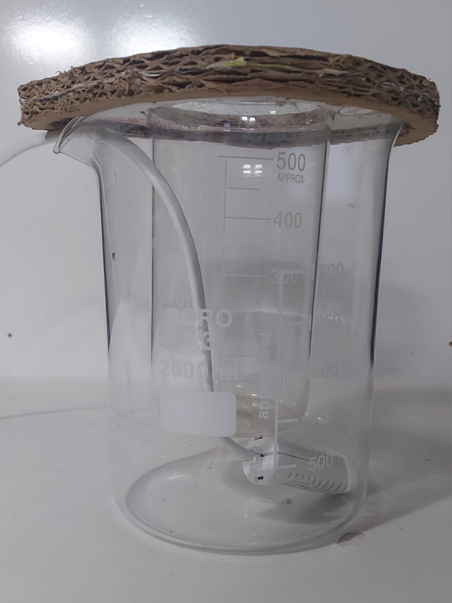
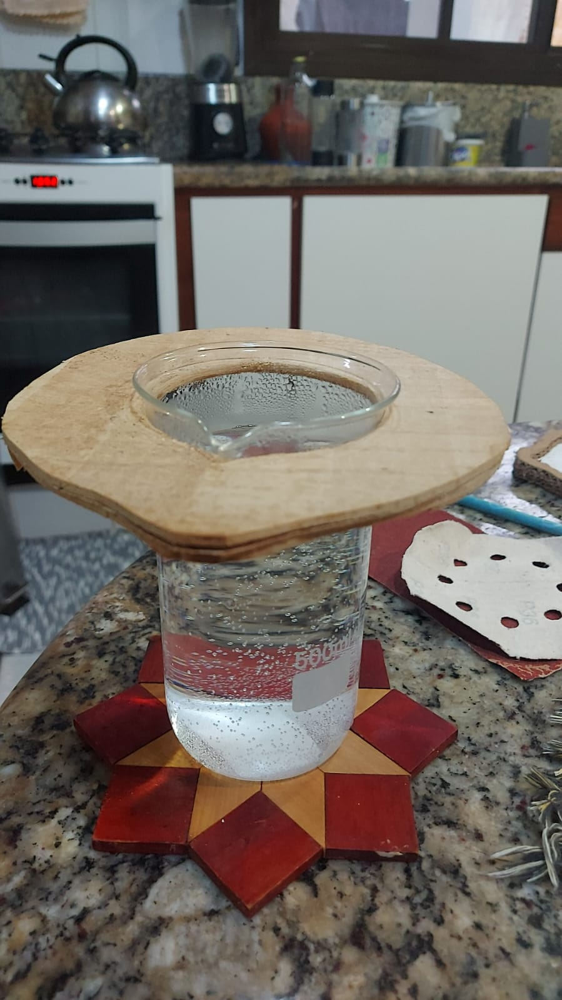

## Teste funcionalidade da tampa de apoio
Foram feitos 2 prototipos sendo o primeiro em papelão ([Figura 1](#fig-tampa-em-papelao)) com o proposito de verificar encaixes e resistencia. E o segundo em madeira ([Figura 2](#fig-tampa-em-madeira)) para vibializar o teste de temperatura.

||
|:-:|
||
|<a id="fig-tampa-em-papelao">**Figura 1** - Tampa em Papelão </a>|

||
|:-:|
||
|<a id="fig-tampa-em-madeira">**Figura 2** - Tampa em Madeira </a>|

## Teste sensor de temperatura (DS18B20)

Foi realizado o teste do sensor utilizando o valor de tensão que haviamos projetado para o circuito, que até então era 3,3V, porém o sensor não funcionou nessa faixa de tensão. O teste foi repetido com 5V e assim foi possível estabelecer a comunicação com sucesso. Como alguns outros pontos do circuito também requisitam 5V decidimos trocar o microcontrolador e trabalhar com 5V em todo o circuito (exlcuindo o ebulidor, que funciona em 220 VAC, e os eletrodos, que utilizam 24 VDC) 

## Teste de transferencia de temperatura

## Teste do motor DC (3V 13100 RPM DC MOTOR)
